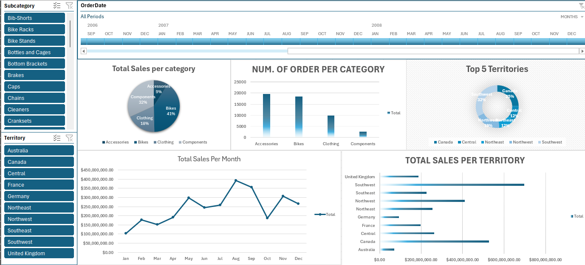

# 📊 AdventureWorks Sales Dashboard Analysis (Excel)

This project provides a detailed analysis of the Sales Dashboard visualized from AdventureWorks data, focusing on sales trends, category performance, and regional contributions.

## 🧩 Dashboard Components

### 1. Total Sales per Category (Pie Chart)
| Category     | Sales Share |
|--------------|-------------|
| Bikes        | 41%         |
| Components   | 32%         |
| Clothing     | 18%         |
| Accessories  | 9%          |

**Insights:**
- Bikes and Components dominate, contributing 73% of total sales.
- Accessories and Clothing are lower-value, supplementary categories.

### 2. Number of Orders per Category (Bar Chart)
| Category     | Orders Count (Approx.) |
|--------------|-----------------------|
| Accessories  | 18,000+               |
| Bikes        | 17,000+               |
| Clothing     | 10,000                |
| Components   | 3,000                 |

**Insights:**
- Accessories lead in order volume but have low revenue share → low unit price.
- Components show high revenue with low order volume → high unit price.

### 3. Top 5 Territories (Donut Chart)
| Territory   | Sales Share |
|-------------|-------------|
| Canada      | 35%         |
| Southwest   | 32%         |
| Central     | 12%         |
| Northeast   | 11%         |
| Northwest   | 10%         |

**Insights:**
- Canada and Southwest account for two-thirds of total sales.
- Central, Northeast, and Northwest contribute modestly.

### 4. Total Sales per Month (Line Chart)
**Observations:**
- Sales peak in July and September (~$400K).
- Dips occur in February and October.
- Indicates seasonal purchasing trends, likely aligned with outdoor activities.

### 5. Total Sales per Territory (Bar Chart)
| Territory         | Sales Amount (Approx.) |
|-------------------|-----------------------|
| Southwest         | $750,000              |
| Canada            | $600,000              |
| Northwest         | $400,000              |
| Australia/UK/etc  | < $200,000            |

**Insights:**
- Southwest and Canada are the top-performing regions.
- Several regions underperform (e.g., Australia, UK) — opportunity for strategic review.

### 6. Interactive Filters
- **Subcategory Filter:** Enables analysis by specific product types (e.g., Brakes, Chains).
- **Territory Filter:** Allows dynamic regional breakdown.

**Usage:**
- Useful for performing granular analysis and identifying trends by product or location.

---

## 🛠️ Tools Used
- Microsoft Excel
  - Used for data visualization, interactive slicers, and creating charts. Excel's PivotTables and Timeline slicers enabled time-based filtering and categorical breakdowns.

---

- ## Dashboard Preview

